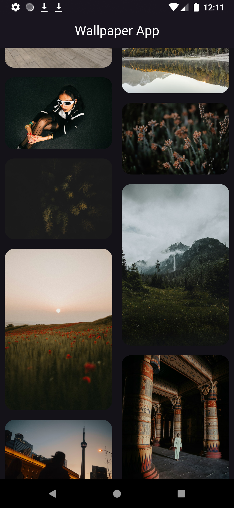
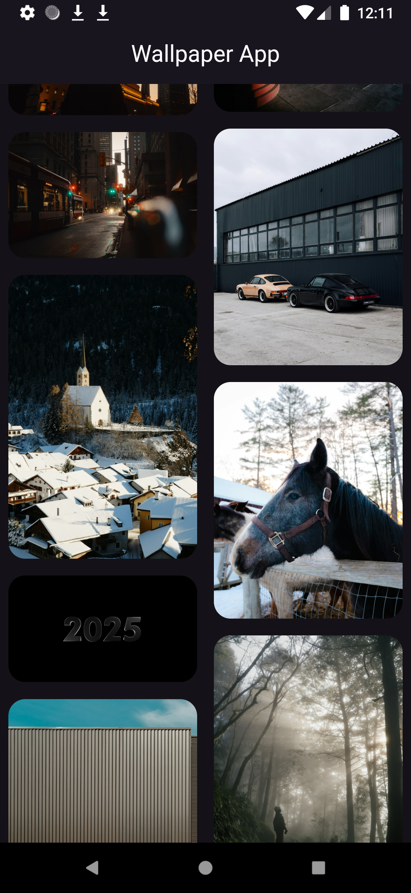
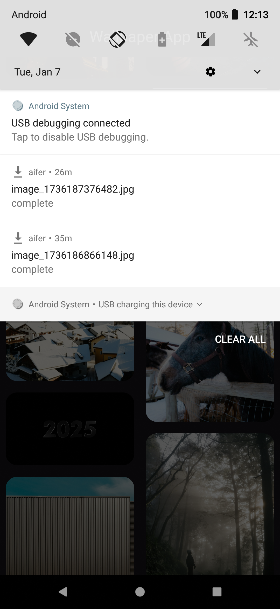

# Wallpaper App

A Flutter wallpaper app that lets you browse and download high-quality images.

## App Screenshots

  
  
    

## Download APK
[Download the latest APK](https://github.com/Azhar9645/Aifer-machine-task/blob/main/apk/app-release.apk)
Drive Link: https://drive.google.com/file/d/1_BhwMfvr5RCradxklKUoEcnEu1fzrbS5/view?usp=sharing

## Getting Started

- Clone the repository  
- Run `flutter pub get`  
- Connect a device or emulator  
- Run the app with `flutter run`
